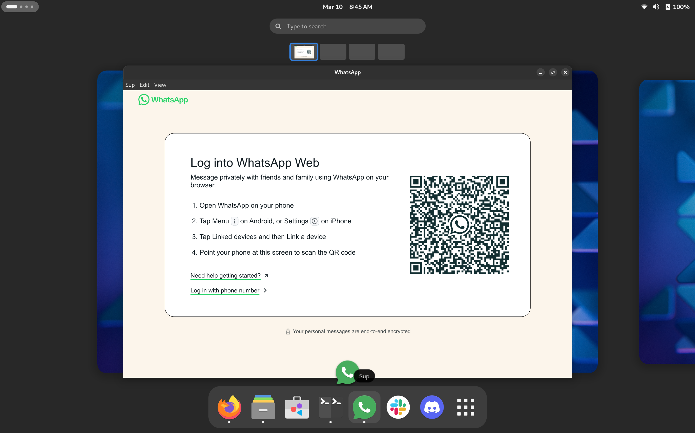

# Sup

A simple WhatsApp Web Client for Linux.



## Features

- Access WhatsApp Web from your desktop
- Native desktop notifications
- Open links in your default browser
- Linux AppImage for easy installation

## Development

### Prerequisites

- [Node.js](https://nodejs.org/) (v14 or later)
- npm (comes with Node.js)

### Setup

1. Clone this repository
2. Install dependencies:
   ```
   npm install
   ```
3. Start the application:
   ```
   npm start
   ```

### Build

To build the application for Linux (AppImage):

```
npm run dist
```

This will create an AppImage in the `dist` directory.

## Usage

After launching the application, you'll need to scan the QR code with your phone's WhatsApp app to log in, just like you would with WhatsApp Web in a browser.

## License

This project is licensed under the MIT License - see the [LICENSE.md](LICENSE.md) file for details.

Copyright (c) 2025 Danilo Falcão
